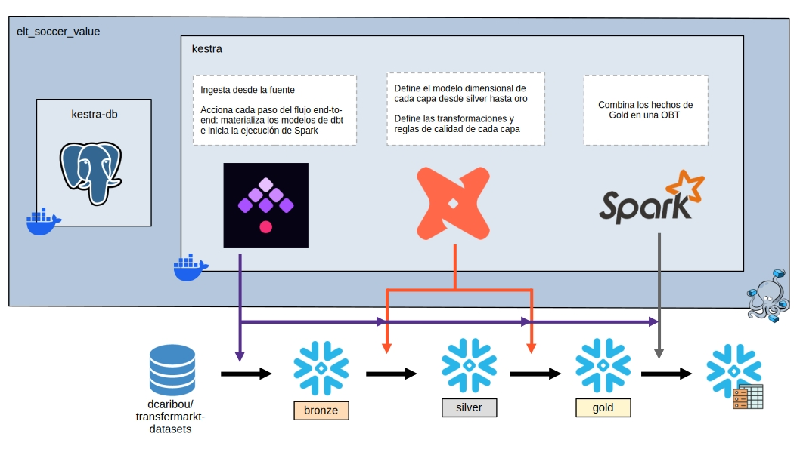
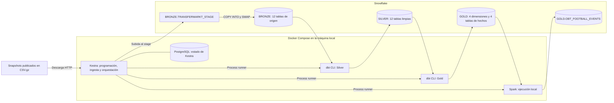
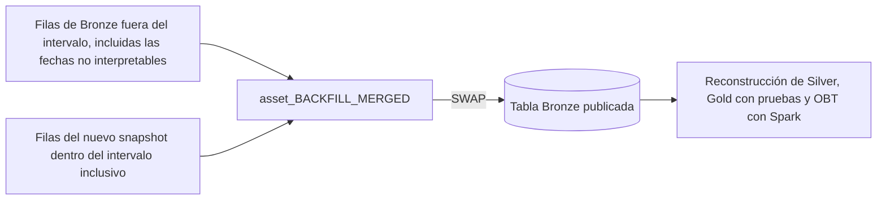
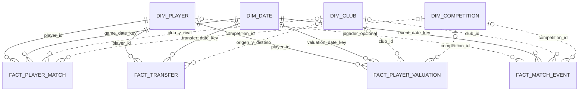

# ELT de datos de fútbol y valor de mercado

Este proyecto prepara datos de fútbol para un futuro modelo de cambios en el valor de mercado de los jugadores. Kestra carga doce copias completas de los datos de Transfermarkt en Snowflake. dbt  define un modelo dimensional en una arquitectura tipo medalla. Spark combina las tablas de hechos resultantes en una tabla de eventos OBT.

El [dataset](https://github.com/dcaribou/transfermarkt-datasets) contiene valoraciones históricas, participaciones de jugadores en partidos, acciones de partido y transferencias. El cálculo de variables mediante ventanas temporales, la definición de la variable objetivo y el entrenamiento del modelo corresponden a la siguiente etapa del proyecto.

- [Arquitectura](#arquitectura)
- [Ejecutar el pipeline](#ejecutar-el-pipeline)
- [Ejecutar dbt o Spark por separado](#ejecutar-dbt-o-spark-por-separado)
- [Ingesta y backfill](#ingesta-y-backfill)
- [Decisiones de calidad de datos](#decisiones-de-calidad-de-datos)
- [Modelo dimensional Gold](#modelo-dimensional-gold)
- [Tabla de eventos con Spark](#tabla-de-eventos-con-spark)
- [Verificar los resultados](#verificar-los-resultados)
- [Estructura del repositorio](#estructura-del-repositorio)
- [Limitaciones](#limitaciones)


## Arquitectura





Compose inicia dos servicios: `kestra` y `kestra-db`. La imagen personalizada de Kestra también contiene dbt y PySpark, que se ejecutan como procesos locales dentro del mismo contenedor. Esta implementación no tiene servicios independientes de Spark para el nodo maestro o los trabajadores. PostgreSQL almacena el estado de la orquestación; las tablas de fútbol se guardan en Snowflake.

El [Dockerfile](Dockerfile) fija las versiones de Kestra en `v1.3.37`, `dbt-snowflake` en `1.12.1` y PySpark en `3.5.9`. dbt y Spark usan entornos virtuales de Python separados. Java 17 se instala en `/opt/java17` para Spark; Kestra conserva el entorno Java de su imagen base. La ejecución de Spark usa el conector de Snowflake `3.2.2-spark_3.5` para Scala 2.12 y Snowflake JDBC `4.0.2`.


## Ejecutar el pipeline

Ejecuta los ejemplos de comandos desde la raíz del repositorio, con Bash o un intérprete compatible.

### Requisitos

Necesitas Docker con Compose, el puerto local `8080` disponible y una cuenta de Snowflake que acepte la autenticación configurada con usuario y contraseña. El rol seleccionado debe tener permisos para crear el warehouse y la base de datos si no existen, crear esquemas y objetos de carga, cargar y reemplazar tablas, y leer las capas analíticas. Para usar `SWAP` y reemplazar objetos existentes también se necesitan los permisos de propiedad correspondientes.

### Configurar el entorno

Crea la configuración local si todavía no existe `.env`:

```bash
cp .env.example .env
```

Edita `.env` con los parámetros de conexión. Este archivo está excluido de Git.

| Variables | Uso |
| --- | --- |
| `K_POSTGRES_DB`, `K_POSTGRES_USER`, `K_POSTGRES_PASSWORD` | Base de datos y credenciales de PostgreSQL para el estado de Kestra. |
| `K_USER`, `K_PASSWORD` | Credenciales de autenticación básica para la interfaz y la API de Kestra. |
| `SNOWFLAKE_ACCOUNT` | Identificador de cuenta sin `https://` ni `.snowflakecomputing.com`; el flujo construye el nombre del servidor JDBC. |
| `SNOWFLAKE_USER`, `SNOWFLAKE_PASSWORD`, `SNOWFLAKE_ROLE` | Conexión a Snowflake y rol de ejecución. |
| `SNOWFLAKE_WAREHOUSE`, `SNOWFLAKE_DATABASE` | Warehouse de cómputo y base de datos de destino. |
| `SNOWFLAKE_BRONZE_SCHEMA`, `SNOWFLAKE_SILVER_SCHEMA`, `SNOWFLAKE_GOLD_SCHEMA` | Usa `BRONZE`, `SILVER` y `GOLD`, respectivamente. |
| `SNOWFLAKE_RAW_SCHEMA` | Lo usa el ejemplo de taxis conservado en el repositorio. El flujo de fútbol comienza en Bronze. |

Mantén los nombres de los tres esquemas como se indican. Aunque los flujos aceptan variables para los esquemas, [sources.yml](dbt/models/sources.yml) fija el origen de dbt en `BRONZE`, y [dbt_project.yml](dbt/dbt_project.yml) fija los esquemas de los modelos en `SILVER` y `GOLD`. Esos archivos no usan las variables `DBT_*_SCHEMA` que proporciona Compose.

`.env.example` también contiene `SPARK_MASTER=local[*]` y `SPARK_DRIVER_MEMORY=4g`. La versión actual del ELT no pasa estas variables al contenedor, por lo que las tareas de fútbol usan los valores predeterminados de sus comandos: `local[4]` y `2g`. Para modificar las ejecuciones programadas, añade las variables a `kestra.environment` en la configuración de Compose y vuelve a crear el contenedor.

### Iniciar los servicios

```bash
docker compose up --build
docker compose ps
```

Cuando termine el arranque, abre [Kestra](http://localhost:8080) e inicia sesión con `K_USER` y `K_PASSWORD`.

### Registrar y ejecutar los flujos de fútbol

Comprueba que el espacio de nombres `company.team` contiene estos flujos:

| ID del flujo | Definición | Uso |
| --- | --- | --- |
| `elt_football_it1` | [Flujo principal](kestra/flows/main_company.team_elt_football_it1.yml) | Carga inicial y actualización de snapshots completos. |
| `backfill_football_it1` | [Flujo de backfill](kestra/flows/main_company.team_elt_football_back_it1.yml) | Actualización de tablas seleccionadas, con un intervalo de fechas para las tablas temporales. |

Los archivos se montan en `/app/flows`. Si los flujos no aparecen en la interfaz, crea cada uno en el editor, pega su definición YAML y guárdalo. Un archivo montado puede requerir este registro antes de poder ejecutarse.

En la primera ejecución de `company.team.elt_football_it1`, mantén seleccionadas las doce tablas predeterminadas en `assets`. El flujo crea la infraestructura de Snowflake y las tablas Bronze, y después ejecuta la ingesta, Silver, Gold y Spark en ese orden. Una primera ejecución con una sola tabla dejaría las demás fuentes vacías y produciría un conjunto de datos incompleto.

Después de la carga inicial, el selector `assets` permite actualizar tablas individuales. Cada ejecución sigue reconstruyendo todos los modelos Silver, todos los modelos y pruebas Gold, y la OBT completa. Ejecuta una reconstrucción manual solo cuando ninguno de los dos flujos de fútbol esté en ejecución.

El YAML del flujo principal incluye una programación habilitada: **miércoles y sábado a las 08:00, `America/Guayaquil`**, con la expresión `0 8 * * 3,6`. Revisa el trigger en Kestra antes de dejar el servicio funcionando. `recoverMissedSchedules: LAST` solicita únicamente la ejecución programada pendiente más reciente.

Para detener los servicios locales y conservar sus volúmenes con nombre:

```bash
docker compose down
```

## Ingesta y backfill

La fuente es [dcaribou/transfermarkt-datasets](https://github.com/dcaribou/transfermarkt-datasets), que distribuye snapshots completos en CSV comprimido. Los flujos descargan cada archivo seleccionado desde:

```text
https://pub-e682421888d945d684bcae8890b0ec20.r2.dev/data/<asset>.csv.gz
```

En la consulta realizada el 4 de octubre de 2026, el repositorio de origen indica que las actualizaciones están pausadas y que el conjunto publicado contiene datos hasta el 6 de julio de 2026. La programación local consulta los archivos publicados; mientras la recolección de origen siga pausada, no podrá incorporar observaciones más recientes. Consulta el [estado de la fuente](https://github.com/dcaribou/transfermarkt-datasets#transfermarkt-datasets).

Las doce tablas de origen son `competitions`, `clubs`, `players`, `games`, `appearances`, `player_valuations`, `transfers`, `club_games`, `game_events`, `game_lineups`, `countries` y `national_teams`. Cada una tiene una tabla correspondiente en Bronze y en Silver.

### Publicación de snapshots y reintentos

Para cada tabla, el flujo principal descarga el archivo, lo sube a una ruta del stage específica de la ejecución, crea `<asset>_LOAD` y ejecuta `COPY INTO`. Si la carga termina correctamente, publica la tabla candidata mediante `ALTER TABLE ... SWAP WITH`, elimina el snapshot anterior y borra el archivo del stage y la descarga de Kestra.

Bronze almacena las columnas de negocio del origen como `VARCHAR`, junto con `_source_file`, `_source_row_number` y `_ingested_at`. La correspondencia entre nombres de columnas ignora mayúsculas y minúsculas. El formato CSV convierte los campos vacíos en `NULL`; la conversión de tipos y la limpieza de negocio se realizan en Silver. Bronze conserva los valores de origen y la procedencia de las filas, pero, tras la limpieza de archivos de una carga exitosa, no mantiene snapshots anteriores ni los archivos comprimidos originales.

La descarga HTTP y la subida al stage usan reintentos con espera exponencial: un intervalo inicial de 30 segundos, un intervalo máximo de dos minutos, `maxAttempts: 3` y una duración máxima de cinco minutos. Las cargas SQL usan `ON_ERROR = ABORT_STATEMENT`. Los errores de validación de dbt y los fallos de Spark no se reintentan automáticamente. La tarea de errores registra la ejecución, las tareas fallidas y sus logs.

Cada flujo pone en cola las ejecuciones que superan su límite de concurrencia de uno; la ingesta también procesa las tablas de forma secuencial. Estos límites se aplican [por flujo](https://kestra.io/docs/workflow-components/concurrency). El flujo principal y el de backfill pueden ejecutarse a la vez, así que programa los backfills cuando el principal esté inactivo.

### Backfill histórico

Ejecuta correctamente el flujo principal antes de usar `company.team.backfill_football_it1`: el backfill presupone que las tablas, el stage y el formato de archivo ya existen.

En Kestra, selecciona `assets`, establece `backfill_start` y `backfill_end`, y ejecuta el flujo. Por ejemplo, selecciona `games`, `appearances`, `club_games`, `game_events` y `game_lineups` con fechas de `2025-01-01` a `2025-03-31` para actualizar los registros de partidos de ese intervalo. La fecha inicial debe ser anterior o igual a la final; el flujo no valida expresamente su orden.

| Tablas seleccionadas | Comportamiento del backfill |
| --- | --- |
| `games`, `appearances`, `player_valuations`, `game_events`, `game_lineups` | Reemplaza las filas cuyo campo `date` está dentro del intervalo, incluidos ambos extremos. |
| `transfers` | Reemplaza las filas cuyo campo `transfer_date` está dentro del intervalo, incluidos ambos extremos. |
| `competitions`, `clubs`, `players`, `club_games`, `countries`, `national_teams` | Reemplaza el snapshot completo. No se usa una columna de fecha directa para estas tablas. |



El backfill descarga el archivo actual completo, incluso si reemplaza un intervalo pequeño. Vuelve a cargar los registros históricos que todavía están presentes en ese archivo; no puede reconstruir cómo era el snapshot de origen en una fecha pasada. Las filas del intervalo solicitado que ya no aparezcan en el nuevo snapshot se eliminan de Bronze. Las filas existentes cuyas fechas no puedan interpretarse se conservan fuera del intervalo de reemplazo.

Cada ejecución usa un mismo intervalo para todas las tablas temporales seleccionadas. Si necesitas intervalos distintos, realiza ejecuciones separadas. Después de publicar los cambios, el flujo reconstruye todas las tablas derivadas, independientemente de cuántas fuentes hayan cambiado. Los detalles están en las [decisiones de orquestación y backfill](docs/orchestration_backfill_decisions.md).

## Decisiones de calidad de datos

Silver repite una secuencia de transformaciones SQL: convertir tipos, normalizar, filtrar filas inválidas, reducir duplicados exactos a una fila y eliminar claves con datos contradictorios. Conserva las tres columnas de metadatos de ingesta para rastrear las filas aceptadas hasta Bronze.

| Condición | Acción implementada |
| --- | --- |
| Falta un valor opcional. | Conserva `NULL`. |
| Un valor opcional no puede convertirse o incumple su dominio. | Convierte ese campo en `NULL` y conserva la fila si cumple las demás reglas. |
| Falta un valor obligatorio o es inválido. | Excluye la fila de Silver. |
| Varias filas tienen los mismos valores de negocio normalizados. | Conserva una, ordenando por fecha de ingesta descendente, archivo de origen y número de fila. |
| Una misma clave natural tiene atributos normalizados distintos. | Excluye todas las filas en conflicto. |
| Se incumple una regla esencial entre campos. | Excluye la fila; por ejemplo, un partido cuyo club local y visitante son iguales. |
| Falta un registro padre exigido expresamente. | Excluye la fila. Otros identificadores históricos pueden conservarse sin una correspondencia en la dimensión actual. |

La comparación de duplicados se realiza después de la normalización y excluye los metadatos de ingesta. El código no escoge la versión de negocio más reciente entre filas contradictorias. Tampoco crea una tabla de cuarentena para las exclusiones.

[decisions.md](docs/decisions.md) recoge la evidencia del análisis de calidad que dio lugar a estas reglas. Las cifras corresponden al snapshot analizado en ese documento y no a una medición nueva de las descargas actuales:

| Problema observado | Decisión y motivo |
| --- | --- |
| Faltaban los 796 valores de `total_market_value` de clubes. | Se conservan como `NULL`; cero afirmaría que se conoce el valor de mercado. |
| Faltaba aproximadamente el 49 % de los nombres de entrenadores de clubes. | Se admite la ausencia de contexto descriptivo sin eliminar el club. |
| Faltaba aproximadamente el 28,5 % de las posiciones de liga en `club_games`. | Se conserva `NULL`; una posición de liga no aplica a todos los partidos. |
| 25 698 números de camiseta en las alineaciones contenían `-`. | Se convierte el marcador en `NULL` antes de convertir el campo a entero. |
| Faltaban dos nombres de jugadores en `appearances`. | Se conservan las filas porque `player_id` identifica al jugador. |
| El análisis no encontró identificadores de jugador huérfanos en valoraciones y transferencias, ni identificadores de país huérfanos en selecciones. | Se exigen esas relaciones con las tablas padre en Silver. |
| Los snapshots actuales de referencia no cubren todos los identificadores históricos de clubes y competiciones. | Se conservan los identificadores y el contexto descriptivo se añade de forma opcional cuando hay correspondencia. |

Los valores centinela tienen significados distintos según el campo. `current_club_id = -1` se conserva como indicador de ausencia de club; `current_national_team_id = -1` se convierte en `NULL`. Las valoraciones distinguen un nombre de club ausente (`Unknown`) del estado de origen `Without Club`. El minuto `-1` de las acciones de partido se conserva; el documento de diseño lo interpreta como tiempo añadido, pero no proporciona un valor exacto de ese tiempo.

Los importes se convierten a valores decimales en EUR. Las tarifas de transferencia ausentes permanecen como `NULL`. Los balances netos de transferencias de clubes admiten ambos signos y convierten los sufijos `k`, `m` y `b`. Los conteos no pueden ser negativos, los porcentajes deben estar entre 0 y 100 y los valores opcionales inválidos se convierten en `NULL`. Las fechas de nacimiento no pueden ser posteriores a `CURRENT_DATE()`; si la fecha de vencimiento de un contrato precede a una fecha de nacimiento conocida, se rechaza la fila del jugador.

Estas comprobaciones cubren la completitud de los campos obligatorios, la validez de tipos y dominios, y la consistencia entre campos y tablas relacionados. No verifican de forma independiente la exactitud real de una valoración de Transfermarkt o de la descripción de un evento.

## Modelo dimensional Gold

Gold contiene cuatro esquemas estrella con dimensiones compartidas: cuatro tablas de hechos y cuatro dimensiones en total. Cada tabla de hechos conserva su propia granularidad, es decir, la observación de negocio que representa una fila.

| Tabla de hechos | Granularidad / clave natural | Construcción |
| --- | --- | --- |
| `fact_player_match` | `(game_id, player_id)` | Participaciones unidas a partidos y jugadores elegibles; el contexto de `club_games` y de las alineaciones agrupadas es opcional. |
| `fact_match_event` | `game_event_id` | Acciones registradas unidas a partidos. El jugador principal es opcional. |
| `fact_transfer` | `(player_id, transfer_date, from_club_id, to_club_id)` | Transferencias de jugadores elegibles; debe existir al menos uno de los identificadores de club de origen o destino. |
| `fact_player_valuation` | `(player_id, valuation_date)` | Valoraciones de mercado fechadas y no negativas de jugadores elegibles. |



El diagrama muestra las relaciones usadas para consultar contexto analítico. Los vínculos opcionales con clubes, competiciones y jugadores de acciones de partido no se exigen como claves foráneas. Las tablas de hechos pueden contener identificadores sin una fila correspondiente en la dimensión.

`dim_player` exige un identificador de jugador, un nombre y una fecha de nacimiento. Por tanto, un jugador puede existir en Silver y quedar excluido de esta dimensión y de los hechos de participación en partidos, transferencias y valoraciones. `fact_match_event` puede conservar una acción aunque su jugador no esté cubierto por la dimensión.

`dim_club` y `dim_competition` contienen contexto descriptivo de sus snapshots actuales. Los atributos de país y confederación permanecen en la dimensión de competición, sin añadir una dimensión de país independiente. Los países y las selecciones nacionales siguen disponibles en Silver.

`dim_date` genera un calendario continuo entre la fecha mínima y máxima de los hechos elegibles. Su clave tiene el formato `YYYYMMDD`; los campos de día de la semana y semana del año usan las convenciones ISO. Las alineaciones se agrupan primero por `(game_id, player_id)` para obtener los indicadores de titularidad y capitanía, de modo que esa unión no multiplique las filas de participación.

Gold excluye todas las filas de un grupo con clave natural duplicada mediante `QUALIFY COUNT(*) ... = 1`. Las cuatro pruebas de cardinalidad comparan cada tabla de hechos con las filas de Silver que cumplen sus reglas de inclusión y sobreviven a esa exclusión. Las pruebas de unicidad y relaciones verifican después la salida. Consulta las [decisiones de Gold](docs/final-gold.md) para conocer los contratos de cada campo.

Usa el modelo dimensional para analizar un proceso concreto, por ejemplo minutos por jugador y competición o valoraciones por fecha. Unir directamente las participaciones en partidos con todas las valoraciones de un mismo jugador multiplicaría las observaciones, salvo que la consulta defina primero una relación temporal o agregue cada proceso.

## Tabla de eventos con Spark

[obt_football_events.py](spark/obt_football_events.py) proyecta cada tabla de hechos a un esquema común y combina las proyecciones verticalmente con `unionByName`. Después añade contexto de las dimensiones mediante uniones que deben conservar el número de filas.

| `event_type` en la OBT | Tabla de hechos de origen | Fecha común `event_date` |
| --- | --- | --- |
| `PLAYER_MATCH` | `fact_player_match` | `game_date` |
| `MATCH_ACTION` | `fact_match_event` | `event_date` |
| `TRANSFER` | `fact_transfer` | `transfer_date` |
| `VALUATION` | `fact_player_valuation` | `valuation_date` |

La granularidad de la OBT es una observación fechada de uno de estos cuatro procesos. Una fila `PLAYER_MATCH` representa la participación completa de un jugador en un partido; una fila `MATCH_ACTION` representa una acción registrada. Por eso, `event_type` es necesario para interpretar o agregar las medidas. Los campos que no aplican a un tipo permanecen en `NULL`. En las transferencias, el campo principal `club_id` queda en `NULL`; el origen y el destino se expresan mediante `from_club_id` y `to_club_id`.

`source_fact`, `source_key` y el identificador de origen disponible permiten rastrear cada evento. `source_record_id` contiene `appearance_id` para participaciones y `game_event_id` para acciones de partido; queda en `NULL` para transferencias y valoraciones.

La cobertura del calendario es obligatoria. El contexto del jugador, de jugadores relacionados, de clubes y de competiciones se añade mediante uniones izquierdas (`LEFT JOIN`). Antes de escribir la tabla, Spark comprueba los campos obligatorios, el dominio de tipos de evento, los contratos por tipo, la unicidad de los identificadores y los conteos por tipo y total. También cuenta el resultado después de cada unión con una dimensión. Los DataFrames intermedios de eventos se almacenan con `DISK_ONLY` para limitar el uso de memoria.

La relación exigida entre los conteos es:

```text
Filas OBT = filas de fact_player_match
          + filas de fact_match_event
          + filas de fact_transfer
          + filas de fact_player_valuation
```

Spark lanza un error si se incumple un contrato y solo escribe después de que la validación termine correctamente. La escritura en Snowflake usa `overwrite`, por lo que volver a ejecutar el proceso sobre el mismo estado de Gold no acumula eventos.

Usa la OBT para consultar la trayectoria temporal de un jugador entre procesos y construir después observaciones con granularidad `(player_id, observation_date)`. Variables como los minutos de los 90 días anteriores o el cambio de valor en los doce meses siguientes todavía requieren ventanas temporales explícitas. La tabla conserva `contract_expiration_date` del snapshot de jugadores; usar ese dato en entrenamiento histórico requiere evidencia de que el contrato se conocía en la fecha de observación. Las [decisiones de la OBT](docs/obt_decisions.md) detallan la correspondencia de columnas y el contrato de identidad.

## Verificar los resultados

En Kestra, comprueba que la ingesta, `dbt_build_silver`, `dbt_build_gold` y `spark_build_obt` terminen correctamente. Las dos construcciones de dbt ejecutan pruebas. Los contratos YAML incluyen `not_null`, `unique` para claves simples y compuestas, `accepted_values` y las relaciones obligatorias `relationships`. Las pruebas SQL de `dbt/tests/gold/` comprueban la cardinalidad de los hechos.

Spark registra conteos con `[COUNT]`, uniones correctas con `[JOIN OK]` y comprobaciones con `[VALIDATION OK]`. Al terminar la escritura emite `[WRITE OK]` y `[SUCCESS]`. Un código de salida distinto de cero hace fallar la tarea, aunque el flujo redirija stderr a stdout.

En una hoja de trabajo de Snowflake, inspecciona las tablas publicadas y compara los conteos de eventos:

```sql
USE DATABASE FOOTBALL;

SHOW TABLES IN SCHEMA BRONZE;
SHOW TABLES IN SCHEMA SILVER;
SHOW TABLES IN SCHEMA GOLD;

WITH expected AS (
    SELECT 'PLAYER_MATCH' AS event_type, COUNT(*) AS fact_rows
    FROM GOLD.FACT_PLAYER_MATCH
    UNION ALL
    SELECT 'MATCH_ACTION', COUNT(*) FROM GOLD.FACT_MATCH_EVENT
    UNION ALL
    SELECT 'TRANSFER', COUNT(*) FROM GOLD.FACT_TRANSFER
    UNION ALL
    SELECT 'VALUATION', COUNT(*) FROM GOLD.FACT_PLAYER_VALUATION
), actual AS (
    SELECT event_type, COUNT(*) AS obt_rows
    FROM GOLD.OBT_FOOTBALL_EVENTS
    GROUP BY event_type
)
SELECT e.event_type, e.fact_rows, COALESCE(a.obt_rows, 0) AS obt_rows,
       e.fact_rows = COALESCE(a.obt_rows, 0) AS counts_match
FROM expected e
LEFT JOIN actual a ON e.event_type = a.event_type;

SELECT COUNT(*) AS rows,
       COUNT(DISTINCT event_id) AS distinct_events,
       COUNT_IF(event_id IS NULL) AS missing_event_ids
FROM GOLD.OBT_FOOTBALL_EVENTS;

SELECT event_type, MIN(event_date) AS first_date,
       MAX(event_date) AS last_date, COUNT(*) AS rows
FROM GOLD.OBT_FOOTBALL_EVENTS
GROUP BY event_type;
```

Una ejecución completa produce doce tablas Bronze, doce tablas Silver, ocho tablas Gold de dbt y una OBT de Spark en Gold. Cada `counts_match` debe ser verdadero, el total de filas debe coincidir con el número de eventos distintos y no debe haber identificadores de evento ausentes. Las fechas mínima y máxima muestran la cobertura real de cada tipo de evento; una ejecución reciente exitosa no implica que la fuente contenga observaciones recientes.

Para consultar la trayectoria de un jugador, sustituye el identificador de ejemplo por uno presente en tus tablas:

```sql
SELECT event_date, event_type, event_subtype, player_name,
       club_name, minutes_played, market_value_in_eur,
       from_club_name, to_club_name, transfer_fee
FROM FOOTBALL.GOLD.OBT_FOOTBALL_EVENTS
WHERE player_id = 12345
ORDER BY event_date, event_type, event_id;
```

## Estructura del repositorio

```text
.
├── Dockerfile                    # Imagen de Kestra con dbt, Spark y Java 17
├── docker-compose.yml            # Kestra, PostgreSQL, variables, montajes y volúmenes
├── .env.example                  # Plantilla de configuración local
├── .gitignore                    # Excluye .env y artefactos generados
├── LICENSE                       # Licencia MIT del repositorio
├── kestra/
│   └── flows/
│       ├── main_company.team_elt_football_it1.yml
│       ├── main_company.team_elt_football_back_it1.yml
│       └── main_company.team_elt_taxi_satt.yml
├── dbt/
│   ├── dbt_project.yml            # Proyecto football y materialización como tablas
│   ├── models/
│   │   ├── sources.yml           # Doce fuentes Bronze
│   │   ├── silver/               # Doce modelos limpios y pruebas de esquema
│   │   └── gold/                 # Cuatro dimensiones, cuatro hechos y pruebas
│   ├── macros/
│   │   └── generate_schema_name.sql
│   ├── tests/gold/               # Cuatro pruebas de cardinalidad de hechos
│   ├── analyses/                 # Directorio reservado, sin implementaciones
│   ├── seeds/                    # Directorio reservado, sin implementaciones
│   ├── snapshots/                # Directorio reservado; sin historial de snapshots dbt
│   └── README.md                 # Texto inicial de dbt
├── spark/
│   └── obt_football_events.py     # Proyección, contexto, validaciones y escritura
├── docs/
│   ├── CD_PSet_2-1.pdf            # Requisitos del enunciado
│   ├── decisions.md              # Reglas Silver y evidencia del análisis de calidad
│   ├── final-gold.md             # Contratos del modelo dimensional
│   ├── obt_decisions.md          # Esquema de eventos e identidad determinista
│   └── orchestration_backfill_decisions.md
└── logs/                         # Directorio local excluido de Git
```

El flujo de taxis se conserva como ejemplo y no forma parte del pipeline de fútbol. Sus objetos `RAW` y su invocación de dbt difieren de esta implementación. Usa los dos identificadores de flujo de fútbol documentados arriba.

Los documentos de diseño explican los contratos previstos; los archivos SQL, YAML y Python definen el comportamiento ejecutado. Por ejemplo, algunos pasajes de `final-gold.md` indican que una granularidad duplicada debe producir un fallo, mientras que su tabla de reacciones y el SQL excluyen todo el grupo duplicado. Las pruebas de cardinalidad aplican esa misma exclusión.

## Limitaciones

El pipeline procesa los datos por lotes porque recibe snapshots publicados y el análisis previsto estudia valoraciones a lo largo de meses. Consultar la fuente dos veces por semana y reconstruir las tablas derivadas corresponde a ese uso. Una arquitectura de streaming requeriría una fuente que emita cambios individuales y un caso de uso con baja latencia, como decisiones durante un partido en vivo. También exigiría gestionar el tiempo de los eventos, las llegadas tardías y las actualizaciones incrementales de las tablas derivadas.

Las siguientes restricciones afectan al uso de los resultados:

- Los archivos de origen no se fijan mediante una suma de comprobación o una versión. Una ejecución posterior puede descargar datos distintos, y la limpieza de una carga exitosa elimina archivos y tablas de snapshots anteriores. El procedimiento es reproducible; para recuperar exactamente un conjunto pasado se necesita un archivo histórico de la fuente. La regla de fecha de nacimiento en Silver también depende de la fecha de ejecución.
- La publicación es atómica por tabla Bronze. La actualización de las doce tablas, las capas de dbt y la OBT no comparten una transacción. Un fallo puede dejar tablas o capas de ejecuciones diferentes; vuelve a ejecutar el flujo completo para reconstruir un conjunto consistente de salidas.
- Las dimensiones de snapshot no tienen intervalos de vigencia ni historial de dimensiones lentamente cambiantes. Las descripciones de clubes y los atributos contractuales asociados a hechos históricos pueden reflejar el snapshot actual. Las variables de entrenamiento necesitan comprobaciones adicionales sobre la información disponible en la fecha de observación.
- Las exclusiones de Silver y las exclusiones de duplicados de Gold no tienen una tabla de rechazos ni un informe de calidad persistido. Bronze permite investigarlas, pero las pruebas de las salidas aceptadas no contabilizan todas las filas excluidas ni demuestran la exactitud de la fuente.
- Los dos flujos de fútbol pueden ejecutarse simultáneamente. Sus colas por flujo no protegen las tablas compartidas frente a una superposición entre actualización y backfill, ni frente a una ejecución manual de dbt o Spark.
- Las reconstrucciones completas simplifican la implementación, pero repiten los costos de descarga y cómputo. La validación de uniones en Spark añade recorridos de los datos y uso de disco local. El flujo principal configura un paralelismo de cuatro y ocho particiones de shuffle; el comando del backfill omite esas opciones explícitas. Las notas de orquestación documentan un fallo anterior de memoria con `exit code 137` al usar recursos más altos.

Para investigar un fallo, comienza por la tarea fallida en Kestra. Si ocurre al crear objetos de Snowflake, revisa la conexión y los permisos del rol. Los fallos de dbt muestran el modelo o la prueba que falló. Los errores de Spark indican columnas ausentes, contratos inválidos, cambios de cardinalidad o problemas de escritura. Si una ejecución manual de dbt informa que el sistema de archivos es de solo lectura, comprueba que las rutas de artefactos y logs apunten a `/tmp`. Si Spark falla al resolver los paquetes del conector, revisa el acceso a Maven y `/tmp/.ivy2`.

