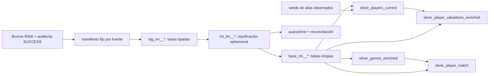

# Contrato Transfermarkt de Bronze a Silver

## Alcance y evidencia

Este contrato cubre las fuentes y entidades limpias reutilizables de Silver. No
define Gold ni variables del modelo predictivo. Se basa en:

- los 12 assets declarados en `config/assets.yml`;
- el DDL de `src/ingestion/snowflake.py` y `sql/bronze/objects.sql`;
- `TRANSFERMARKT_INGESTION_FILES`, que audita cada versión publicada;
- perfiles de solo lectura y un `dbt build` real ejecutados el 3 de octubre de
  2026 contra un target aislado.

Bronze, su ingesta y sus vistas `*_LATEST` no se modifican. dbt consume las
tablas `*_RAW` para poder fijar una versión auditada por fuente. En el snapshot
verificado, las 12 fuentes suman 7.497.433 registros.

## Forma física de Bronze

Cada tabla `*_RAW` tiene la misma envoltura:

| Columna | Tipo Snowflake | Significado |
|---|---|---|
| `RAW_RECORD` | `VARIANT NOT NULL` | Encabezados y valores originales del CSV. |
| `SOURCE_URL` | `VARCHAR NOT NULL` | URL del snapshot completo. |
| `SOURCE_FILE` | `VARCHAR NOT NULL` | Archivo capturado. |
| `SOURCE_FILE_SHA256` | `VARCHAR NOT NULL` | Identidad de contenido. |
| `SOURCE_ROW_NUMBER` | `NUMBER NOT NULL` | Posición después del encabezado. |
| `INGESTION_RUN_ID` | `VARCHAR NOT NULL` | Ejecución que publicó la fila. |
| `LOADED_AT` | `TIMESTAMP_TZ NOT NULL` | Publicación Bronze; no es fecha del evento. |

Staging conserva también `source_version`, `source_captured_at`,
`source_checked_at`, `bronze_finished_at` y `manifest_resolved_at` provenientes
de auditoría, además de `RAW_RECORD`. Las bases aceptadas agregan
`silver_processed_at`. Un timestamp ausente en auditoría permanece `NULL`; no
se infiere una captura a partir de una fecha de negocio.

## Selección reproducible de snapshots

Las fuentes son snapshots completos y `*_RAW` acumula versiones distintas. Una
ejecución Silver sigue este protocolo:

1. `base_tm__source_manifest` selecciona un `SUCCESS` por asset, ordenado de
   forma determinista por `finished_at` y `run_id`.
2. El manifiesto se materializa antes de staging.
3. Cada `stg_tm__*` une su tabla RAW por `ingestion_run_id` y SHA-256. No lee
   `*_LATEST`, no mezcla archivos y no elige la última fila por jugador.
4. Cada fuente conserva su propia captura y versión; no se exige que los 12
   archivos hayan sido capturados simultáneamente.

La ingesta actual es append-only, por lo que una nueva publicación Bronze no
cambia las filas que ya fijó el manifiesto. Si Bronze cambiara en el futuro a
reemplazo físico de tablas, Kestra deberá impedir dicho reemplazo mientras dbt
ejecuta; esa coordinación no es necesaria con el contrato actual.

### Manifiesto explícito

La variable dbt `transfermarkt_source_manifest` acepta un mapa completo de los
12 assets, cada uno con `ingestion_run_id` y `source_file_sha256`. Faltantes,
campos incompletos o assets desconocidos producen error de compilación. Si una
pareja solicitada no existe como `SUCCESS`,
`assert_transfermarkt_manifest_complete` falla antes de que `dbt build`
continúe con staging.

Flujo manual:

```powershell
# Resuelve y materializa una selección auditada.
docker compose --profile silver run --rm dbt build `
  --target test --select base_tm__source_manifest+ --no-version-check

# Emite el mapa reutilizable sin contraseñas.
docker compose --profile silver run --rm dbt run-operation `
  export_transfermarkt_manifest --target test --no-version-check

# En la ejecución definitiva se pasa el mapa completo exportado.
docker compose --profile silver run --rm dbt build `
  --target test --select +tag:silver_stage_2 --no-version-check `
  --vars '{transfermarkt_source_manifest: {players: {ingestion_run_id: ..., source_file_sha256: ...}, ...}}'
```

Se debe usar `dbt build`, no solo `dbt run`, para que la prueba de completitud
proteja el grafo. Los run IDs y checksums son procedencia, no credenciales, pero
no se fijan en el repositorio porque cambian con cada captura.

## Inventario y granularidad observada

| Source RAW / staging / base | Filas verificadas | Granularidad y clave |
|---|---:|---|
| `PLAYERS_RAW` / `stg_tm__players` / `base_tm__players` | 50.149 | una por `player_id`; `not_null` y `unique` pasan |
| `PLAYER_VALUATIONS_RAW` / `stg_tm__player_valuations` / `base_tm__player_valuations` | 656.301 | historial completo por (`player_id`, `valuation_date`); clave validada |
| `NATIONAL_TEAMS_RAW` / `stg_tm__national_teams` / `base_tm__national_teams` | 124 | una por `national_team_id`; clave validada |
| `COUNTRIES_RAW` / `stg_tm__countries` / `base_tm__countries` | 124 | una por `country_id`; clave validada |
| `GAMES_RAW` / `stg_tm__games` / `base_tm__games` | 88.958 | una por `game_id`; clave validada |
| `COMPETITIONS_RAW` / `stg_tm__competitions` / `base_tm__competitions` | 65 | una por `competition_id`; clave alfanumérica validada |
| `CLUBS_RAW` / `stg_tm__clubs` / `base_tm__clubs` | 796 | una por `club_id`; clave validada |
| `APPEARANCES_RAW` / `stg_tm__appearances` / `base_tm__appearances` | 1.894.350 | una por `appearance_id`; clave validada |
| `CLUB_GAMES_RAW` / `stg_tm__club_games` / `base_tm__club_games` | 177.916 | una perspectiva por (`game_id`, `club_id`); clave validada |
| `TRANSFERS_RAW` / `stg_tm__transfers` / `base_tm__transfers` | 175.165 | evento fuente sin `transfer_id`; no se inventa clave |
| `GAME_EVENTS_RAW` / `stg_tm__game_events` / `base_tm__game_events` | 1.274.469 | una por `game_event_id`; clave validada |
| `GAME_LINEUPS_RAW` / `stg_tm__game_lineups` / `base_tm__game_lineups` | 3.179.016 | una por el campo fuente `game_lineups_id`, renombrado `game_lineup_id`; clave validada |

Las primeras nueve fuentes son dependencias de los cuatro productos Silver
finales. `transfers`, `game_events` y `game_lineups` ya estaban ingeridas y
reciben el mismo patrón de staging, clasificación, base y calidad.

Los encabezados fuente observados permanecen documentados en `RAW_RECORD`:

- `players`: `player_id`, `first_name`, `last_name`, `name`, `last_season`,
  `current_club_id`, `player_code`, `country_of_birth`, `city_of_birth`,
  `country_of_citizenship`, `date_of_birth`, `sub_position`, `position`,
  `foot`, `height_in_cm`, `contract_expiration_date`, `agent_name`,
  `image_url`, `international_caps`, `international_goals`,
  `current_national_team_id`, `url`, `current_club_domestic_competition_id`,
  `current_club_name`, `market_value_in_eur`, `highest_market_value_in_eur`.
- `player_valuations`: `player_id`, `date`, `market_value_in_eur`,
  `current_club_name`, `current_club_id`,
  `player_club_domestic_competition_id`.
- `national_teams`: `national_team_id`, `name`, `team_code`, `country_id`,
  `country_name`, `country_code`, `confederation`, `team_image_url`,
  `squad_size`, `average_age`, `foreigners_number`, `foreigners_percentage`,
  `total_market_value`, `coach_name`, `fifa_ranking`, `last_season`, `url`.
- `countries`: `country_id`, `country_name`, `country_code`, `confederation`,
  `total_clubs`, `total_players`, `average_age`, `url`.
- `games`: `game_id`, `competition_id`, `season`, `round`, `date`,
  `home_club_id`, `away_club_id`, goles, posiciones, managers, `stadium`,
  `attendance`, `referee`, `url`, formaciones, nombres, `aggregate` y
  `competition_type`.
- `competitions`: `competition_id`, `competition_code`, `name`, `sub_type`,
  `type`, `country_id`, `country_name`, `domestic_league_code`,
  `confederation`, `total_clubs`, `url`.
- `clubs`: `club_id`, `club_code`, `name`, `domestic_competition_id`,
  `total_market_value`, tamaño/edad/extranjeros, estadio,
  `net_transfer_record`, `coach_name`, `last_season`, `filename`, `url`.
- `appearances`: `appearance_id`, `game_id`, `player_id`, ambos club IDs,
  `date`, `player_name`, `competition_id`, tarjetas, goles, asistencias y
  `minutes_played`.
- `club_games`: `game_id`, `club_id`, goles/posición/manager propios y del
  rival, `hosting`, `is_win`.
- `transfers`: `player_id`, `transfer_date`, `transfer_season`, club IDs y
  nombres, `transfer_fee`, `market_value_in_eur`, `player_name`.
- `game_events`: `game_event_id`, `date`, `game_id`, `minute`, `type`, club,
  jugador, descripción, `player_in_id`, `player_assist_id`.
- `game_lineups`: `game_lineups_id`, `date`, `game_id`, `player_id`,
  `club_id`, `player_name`, `type`, `position`, `number`, `team_captain`.

## Normalización y unidades

Staging se limita a nombres, tipos y formatos:

- `trim` y cadena vacía a `NULL`; texto categórico en minúsculas y códigos
  en mayúsculas cuando corresponde;
- identificadores numéricos y conteos como `NUMBER(38,0)`; IDs realmente
  alfanuméricos permanecen `VARCHAR`;
- fechas con `TRY_TO_DATE`, decimales con `TRY_TO_DECIMAL` y booleanos
  observados `0/1` con conversión explícita;
- valores desconocidos permanecen `NULL`. En `game_events`, el valor observado
  `minute=-1` aparece en 17.575 filas y se normaliza a `NULL`, conservando `-1`
  en `RAW_RECORD`; cualquier otro minuto negativo sigue siendo inválido;
- seeds versionados normalizan los valores observados de posición, tipo de
  evento y tipo de alineación. Un valor nuevo conserva su texto normalizado y
  no se reasigna arbitrariamente.

Los campos `*_in_eur`, `transfer_fee` y `total_market_value` ya están en euros
enteros en la fuente, no en miles. Se materializan como `NUMBER(38,2)`:

| Campo perfilado | Cobertura no vacía | Rango observado |
|---|---:|---:|
| `player_valuations.market_value_in_eur` | 656.301 / 656.301 | 0 a 200.000.000 EUR |
| `players.market_value_in_eur` y máximo histórico | 41.528 / 50.149 | 10.000 a 200.000.000 EUR |
| `national_teams.total_market_value` | 120 / 124 | 350.000 a 947.000.000 EUR |
| `transfers.market_value_in_eur` | 107.005 / 175.165 | 10.000 a 180.000.000 EUR |
| `transfers.transfer_fee` | 113.639 / 175.165 | 0 a 222.000.000 EUR |
| `clubs.total_market_value` | 0 / 796 | no informado; queda `NULL` |

`clubs.net_transfer_record` sí es texto formateado (`+-0`, `+€500k`,
`+€2.50m`, `€-2.00m`). Su parser aplica sufijos `k`, `m` y `bn`; el
resultado firmado es EUR. Un saldo negativo es válido. Ningún importe ausente
se sustituye por cero; cero se conserva solo cuando la fuente lo informa.

## Aceptación, duplicados y quarantine

Cada `int_tm__*_classified` calcula SHA-256 del objeto fuente completo y una
clave de negocio cuando existe:

- filas lógicamente idénticas dentro del snapshot se colapsan de forma
  determinista por `source_row_number`;
- si una clave tiene contenidos distintos, todos sus representantes se
  rechazan con `conflicting_duplicate_key`; no se elige un ganador;
- `player_valuations` conserva todas las fechas y solo deduplica su clave
  completa; nunca selecciona la última valoración por jugador;
- `transfers` usa el fingerprint para duplicados idénticos porque la fuente no
  ofrece una clave de evento demostrable.

Son críticos las claves y fechas de negocio requeridas para el grain, y los
nombres de las dimensiones principales. También se rechazan conversiones
fallidas cuando el original no estaba vacío, fechas de nacimiento futuras,
alturas no positivas, porcentajes fuera de 0-100, conteos/marcadores/minutos
negativos, clubes enfrentados consigo mismos e importes negativos. La única
excepción monetaria es el saldo neto de transferencias firmado. La ausencia de
campos opcionales (agente, manager, club de una transferencia, importes no
informados, etc.) no invalida la fila.

`base_tm__quarantine` guarda una fila por representante rechazado con clave,
fingerprint, `RAW_RECORD`, lista de motivos y procedencia completa. Varios
motivos permanecen en un solo array y no multiplican el conteo. La tabla
`base_tm__reconciliation` exige por fuente:

```text
input_rows = accepted_rows + identical_duplicate_rows + rejected_rows
```

Fixtures aislados cubren snapshots viejo/nuevo/fallido, duplicado idéntico,
duplicado conflictivo, clave nula con varios motivos e importe negativo. No se
alteró Bronze para probarlos.

## Pruebas y cobertura observada

Las claves, tipos, unicidad, relaciones y reconciliación se ejecutan con el tag
`silver_stage_2`. Claves/grains, conversiones requeridas, completitud del
manifiesto y reconciliación son errores. Relaciones entre snapshots son
advertencias porque las dimensiones actuales no cubren todo el histórico:

| Relación | Filas sin dimensión | Severidad |
|---|---:|---|
| `games.home_club_id -> clubs.club_id` | 12.818 | warn |
| `games.away_club_id -> clubs.club_id` | 11.242 | warn |
| `games.competition_id -> competitions.competition_id` | 1.214 | warn |
| `appearances.player_id -> players.player_id` | 2 | warn |
| `players.current_club_id -> clubs.club_id` | 2.986 | warn |

Las demás relaciones probadas pasaron. El build final con manifiesto fijo
reconcilió 7.497.433 aceptados, 0 duplicados idénticos y 0 rechazos en el
snapshot actual; quarantine quedó vacía. Esto describe solo las versiones
probadas, no garantiza que capturas futuras carezcan de rechazos.

## Configuración, schemas y seguridad

dbt reutiliza `SNOWFLAKE_ACCOUNT`, `SNOWFLAKE_USER`, `SNOWFLAKE_PASSWORD`,
`SNOWFLAKE_ROLE`, `SNOWFLAKE_WAREHOUSE`, `SNOWFLAKE_DATABASE` y
`SNOWFLAKE_BRONZE_SCHEMA`. Agrega solo schemas/targets Silver:

| Target | Staging (`view`) | Silver (`table`) |
|---|---|---|
| `dev` | `<DBT_DEV_SCHEMA>_STAGING` | `<DBT_DEV_SCHEMA>_SILVER` |
| `test` | `<DBT_TEST_SCHEMA>_STAGING` | `<DBT_TEST_SCHEMA>_SILVER` |
| `prod` | `SNOWFLAKE_STAGING_SCHEMA` exacto | `SNOWFLAKE_SILVER_SCHEMA` exacto |

El target validado fue `DBT_TEST_STAGING` / `DBT_TEST_SILVER`; no se escribió
en los schemas productivos. Staging son vistas, las bases/control/calidad son
tablas y los clasificadores son `ephemeral`. El tag `silver_stage_2` incluye
dependencias, seeds y pruebas; `transfermarkt_aliases` permite seleccionar los
seeds por separado.

La autenticación sigue siendo password con `authenticator: snowflake`. El
contenedor dbt no lee ni monta claves privadas, `.p8` ni passphrases. `.env` no
fue modificado y sus valores no se registran.

## Contrato de salida Silver

- `silver_players_current`: una fila por `player_id` (implementado en etapa 3;
  consulte `docs/silver_players_current.md`).
- `silver_games_enriched`: una fila por `game_id` (implementado en etapa 4;
  consulte `docs/silver_games_enriched.md`).
- `silver_player_match`: una fila por `appearance_id` (implementado en etapa
  5; consulte `docs/silver_player_match.md`).
- `silver_player_valuations_enriched`: una fila por (`player_id`,
  `valuation_date`) (implementado en etapa 6; consulte
  `docs/silver_player_valuations_enriched.md`).

Las cuatro tablas finales Silver están implementadas y validadas conjuntamente.
Su contrato detallado vive en `docs/silver_contract.md`. Gold y el modelo
predictivo siguen fuera del alcance de esta entrega.

## Grafo final y límites temporales



- `silver_players_current` conserva una fila por `player_id`, incluso sin club,
  selección o país resuelto. Nacimiento, ciudadanía y país de selección son
  roles distintos; los IDs Transfermarkt no se tratan como ISO. La fuente
  observada contiene ciudadanía escalar, por lo que no se creó un puente que
  expandiera el grain. Un test detiene futuros valores múltiples hasta que se
  modele `silver_player_citizenships` explícitamente.
- `silver_games_enriched` conserva una fila por `game_id`; competición, local y
  visitante se resuelven con `LEFT JOIN`. Los nombres `*_at_game` proceden del
  partido y los atributos `*_current_snapshot` del catálogo actual.
- `silver_player_match` conserva una fila por `appearance_id` y relaciona
  `club_games` por (`game_id`, `player_club_id`). `player_current_club_id` no
  reemplaza al club representado en el partido.
- `silver_player_valuations_enriched` conserva todo el historial por
  (`player_id`, `valuation_date`). `historical_market_value_eur` está en EUR y
  se distingue de los atributos `*_snapshot`; no se usa el contexto actual
  como hecho conocido en la fecha de valoración.

Todos los enriquecimientos opcionales son `LEFT JOIN`: un catálogo incompleto
produce un estado `not_found`, no elimina el hecho. Los alias de países son
solo variantes observadas versionadas; no hay matching difuso. La fecha del
evento, la captura Bronze y `silver_processed_at` permanecen separadas.

## Verificación integral reproducible

La prueba singular `assert_silver_delivery_contract` reconcilia en un solo
nodo los cuatro conteos finales contra sus bases y comprueba sus grains. El
comando de solo lectura siguiente calcula huellas independientes del orden y
excluye timestamps/IDs/checksums/versiones de procesamiento y lineage
(`*_processed_at`, `manifest_resolved_at`, `*_source_version*`,
`*_source_captured_at` y `*_bronze_ingestion_run_id`):

```powershell
docker compose exec -T kestra /opt/transfermarkt/.venv/bin/python `
  -m ingestion.silver verify --target test
```

La verificación también informa cobertura de joins por rol, balance de los 12
assets, quarantine, rango/suma de EUR y multiplicidad del historial. Se usa
para comparar antes/después de una repetición o `force`; los timestamps de
procesamiento pueden cambiar, pero las claves, conteos y huellas de negocio no.

El backfill Silver no acepta una fecha como sustituto de historia. Requiere un
manifiesto completo de runs/checksums realmente conservados en RAW. Cuando la
auditoría Bronze legada no aporta `source_version` o `source_captured_at`, esos
campos permanecen `NULL`; no se derivan de fechas de partidos ni de la fecha de
ejecución.
